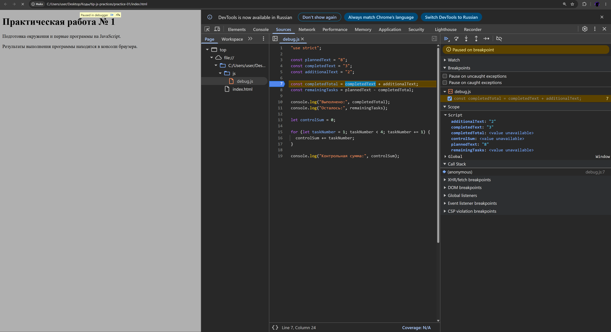

### 1. Автор и вариант

Имя: Анисимов Алексей

Группа: ЭФБО-04-25

№ варианта: 1

### 2. Окружение

- ОС: Windows11
- Node.js: v24.14.0
- npm: 11.11.1
- Git 2.53.0.windows.1
- Браузер: Google

### 3. Запуск

Команды выполняются из корня репозитория 
tip-js-practices: 
node practice-01/js/hello.js 
node practice-01/js/types.js 
node practice-01/js/progress.js 
node practice-01/js/plan.js 
node practice-01/js/debug.js

### 4. Задание 1

Запуск через Node.js:

    Студент: Алексей
    Группа: ЭФБО-04-25
    Практическая работа: 1
    JavaScript успешно запущен
    Тип document: undefined

Вывод появился в терминале

Запуск в браузере:

    Студент: Алексей
    Группа: ЭФБО-04-25
    Практическая работа: 1
    JavaScript успешно запущен
    Тип document: object

Вывод появился в консоли страницы браузера

document — это объект, который даёт браузер. Он появляется, потому что браузер загружает HTML и строит из него DOM. В Node.js HTML нет, значит и document нет — отсюда typeof document === "undefined".

### 5. Задание 2

| Выражение | Ожидание до запуска | Фактическое значение | Тип результата | Объяснение |
|---|---|---|---|---|
| `"8" + 2` | 82 | 82 | string | Если есть строка, + не складывает, а склеивает, "8" и 2 превращаются в "82" |
| `"8" - 2` | 28 | 6 | number | Минус работает только с числами, "8" становится числом 8 |
| `Number("8") + 2` | 10 | 10 | number | Number("8") превращает "8" в число 8, дальше складываются как числа |
| `"12" > "3"` | false | false | boolean | Строки сравниваются по символам, а не как числа, первый символ "1" меньше "3", поэтому false. |
| `12 === "12"` | false | false | boolean | === сравнивает строго, без превращений, слева число, справа строка, типы разные значит false. |
| `Number("")` | ошибка | 0 | number | Пустая строка при превращении в число становится 0 |
| `Number("text")` | ошибка | NaN | number | "text" — не число, получаем NaN, но тип всё равно number |
| `Boolean("false")` | true | true | boolean | Строка не пустая, значит она считается истинной |
| `typeof null` | null | object | string | Это не объект, но почему-то в JS null является объектом |
| `typeof NaN` | number | number | string | NaN считается числом, поэтом number, но сам результат строка |

### 6. Заданиe 3

| Входные данные | Ожидание | Результат | Итог |
|---|---|---|---|---|
| 12, 5 | Осталось 7; 41.7%; «В работе» | Осталось: 7; Прогресс: 41.7%; Статус: В работе |
| 0, 0 | «Задач пока нет» | Задач пока нет |
| 5, 0 | Осталось 5; 0.0%; «Не начато» | Осталось: 5; Прогресс: 0.0%; Статус: Не начато |
| 5, 5 | Осталось 0; 100.0%; «Завершено» | Осталось: 0; Прогресс: 100.0%; Статус: Завершено |
| 5, 6 | Ошибка | Ошибка: выполнено больше задач, чем существует |
| -1, 0 | Ошибка | Ошибка: отрицательное количество |
| 5, 2.5 | Ошибка | Ошибка: дробное количество |
| "5", 2 | Ошибка | Ошибка: вместо числа передана строка |
| 1001, 0 | Ошибка | Ошибка: превышена верхняя граница |
| NaN, 0 | Ошибка | Ошибка: недопустимое числовое значение |

### 7. Заданиe 4

|Входные данные | Ожидание | Результат |
|---|---|---|---|---|
| 12, 5, 3 | 3 дня; в последний день 1 задача | Дни 1–2: по 3, День 3: выполнено 1. Потребуется дней: 3 |
| 10, 4, 3 | 2 дня по 3 задачи | День 1: выполнено 3, осталось 3; День 2: выполнено 3. Потребуется дней: 2 |
| 5, 3, 10 | 1 день, выполнено 2 | День 1: выполнено 2, осталось 0; Потребуется дней: 1 |
| 5, 5, 2 | 0 дней, цикл не выполняется | Все задачи уже выполнены; Потребуется дней: 0 |
| 0, 0, 2 | 0 дней, цикл не выполняется | Задач нет, выполнять нечего; Потребуется дней: 0 |
| 5, 2, 0 | Ошибка, цикл не запускается | Ошибка: дневной лимит должен быть от 1 до 1000 |
| 5, 2, 1.5 | Ошибка |Ошибка: дневной лимит должен быть целым числом |
| 5, 6, 2 | Ошибка: выполнено больше, чем существует |
| 5, 2, "2" | Ошибка | Ошибка: дневной лимит должен быть числом, а не другим типом данных |
| 5, 2, 1001 | Ошибка | Ошибка: дневной лимит должен быть от 1 до 1000 |

### 8. Отладка

Исходный код

    Выполнено: 32
    Осталось: -24
    Контрольная сумма: 6

Страница открыта в браузере, в DevTools на вкладке Sources поставлена точка останова на строке вычисления completedTotal. До выполнения строки в Scope видно, что completedText и additionalText содержат строки "3" и "2". После Step over completedTotal равно "32", тип string. Вторая точка останова поставлена внутри цикла: переменная taskNumber принимала значения 1, 2, 3, при значении 4 условие taskNumber < 4 стало ложным и цикл завершился, controlSum остался равен 6.

| Ошибка | Что наблюдалось | Причина | Исправление | Результат после исправления |
|---|---|---|---|---|
| Обработка количества задач | `completedTotal` = `"32"` (string), остаток `-24` | Исходные данные — строки, оператор `+` выполнил конкатенацию вместо сложения. Затем `-` неявно преобразовал `"8"` и `"32"` в числа: 8 − 32 = −24 | Явное преобразование: `Number(completedText) + Number(additionalText)` и `Number(plannedText) - completedTotal` | Выполнено: 5, Осталось: 3 |
| Граница цикла | Цикл выполнился для `taskNumber` = 1, 2, 3; контрольная сумма 6 | Условие `taskNumber < 4` не включает 4, хотя по условию нужна сумма от 1 до 4 включительно | Условие заменено на `taskNumber <= 4` | Контрольная сумма: 10 |

После исправления программа проверена в браузере и в Node.js, результаты совпадают.

### 9. Вывод

В ходе работы подготовлено окружение (Node.js, npm, Git, VS Code) и освоен базовый цикл разработки: написание кода, запуск в браузере и Node.js, проверка результата, отладка и сохранение изменений в Git. Изучены различия сред выполнения, типы данных, явное и неявное преобразование типов, условия с проверкой входных данных и цикл `while` с корректной последней итерацией.